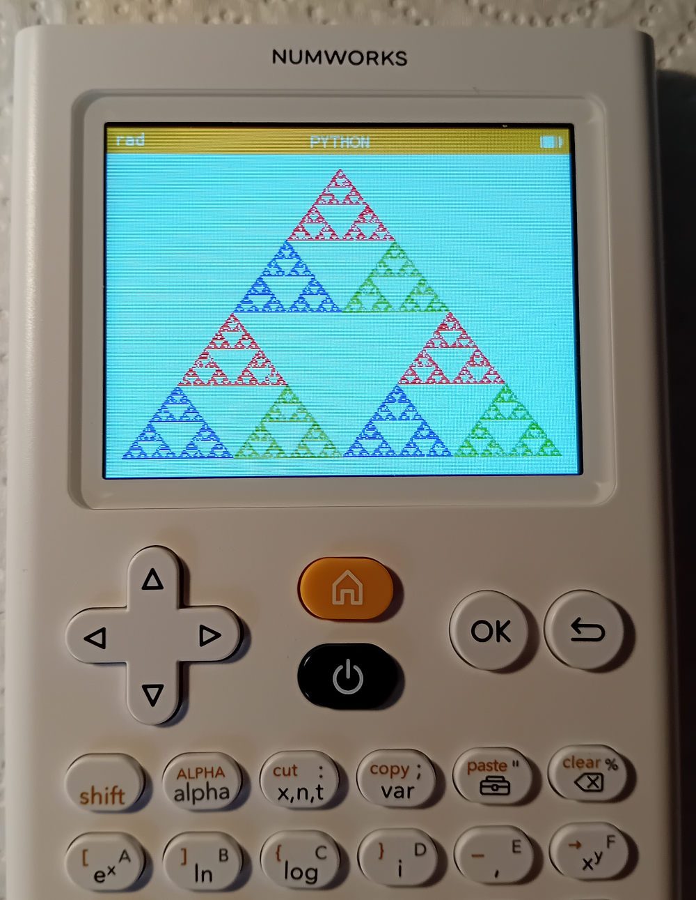
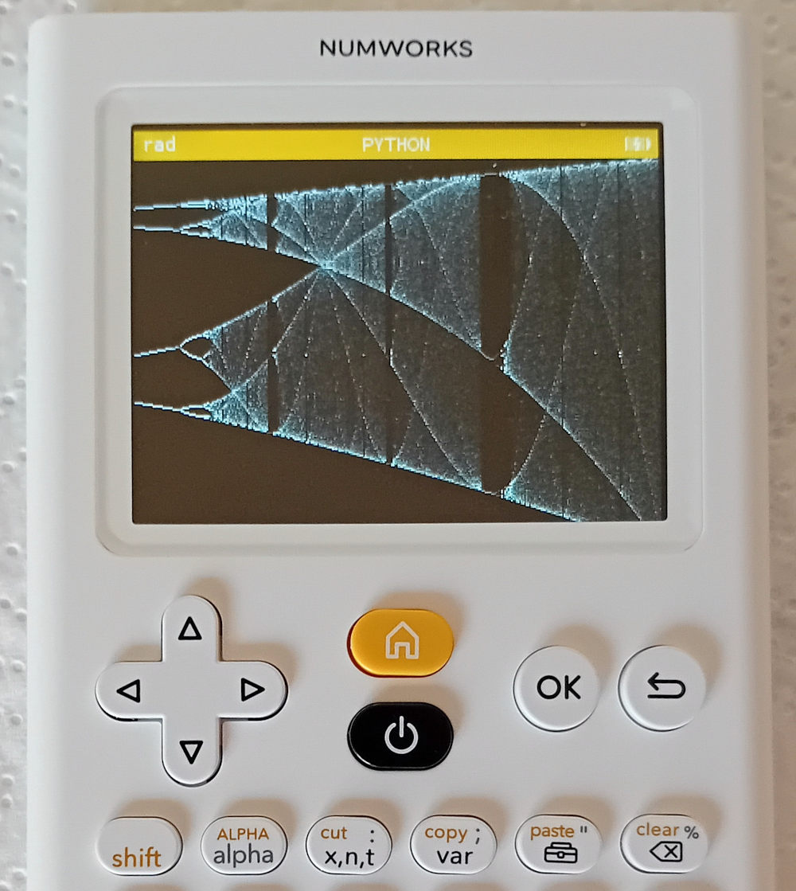

# Numworks-calculator
Python code made to run on a Numworks calculator

## sierpinsky.py

Tested on the calculator using software version 23.2.6. Draws a Sierpinsky triangle on the screen. Defines one function sierp(), this function can be used with 1 parameter defining the number of iterations. Uses libraries math and kandinsky.

## logistic.py

Tested on the calculator using software version 23.2.6. Function logistic_map() draws the bifurcation diagram of the logistic map on the screen. Uses libraries math, numpy and kandinsky. Can be used with 2 parameters logistic_map(astart, aend)

## heron.py

Tested on the calculator using software version 23.2.6. Defines a function heronarea() which calculates the area of a triangle in terms of the three side lengths. The function can be calles with the three lengths as parameters or without parameters. This code can run on CPython as well.
