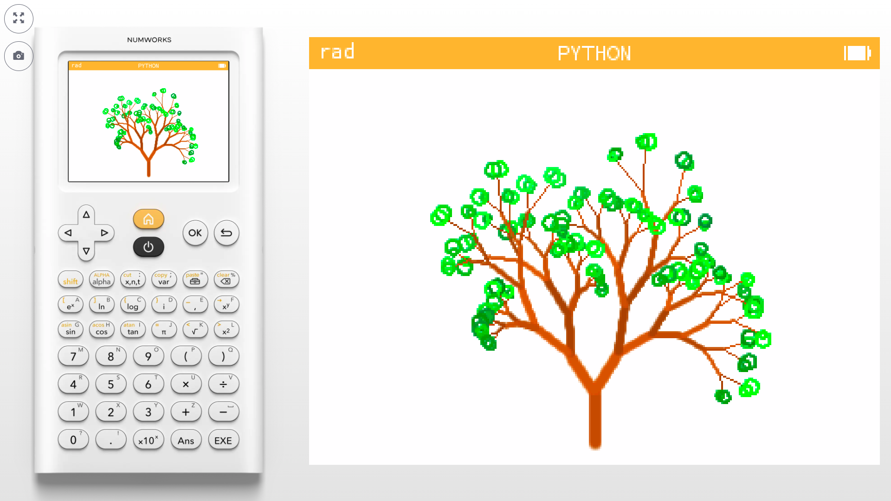
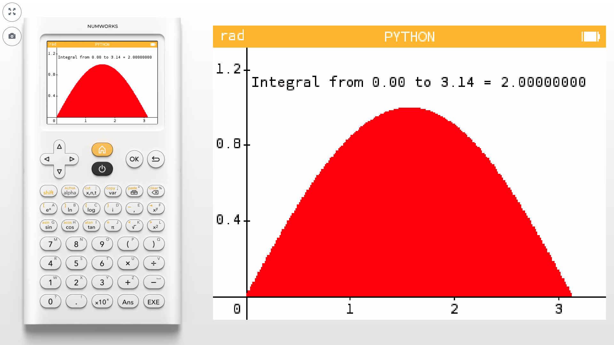

# Numworks-calculator
Python code made to run on a Numworks calculator

Also find these on [https://my.numworks.com/python/vnap0v](https://my.numworks.com/python/vnap0v)

## Contents

   
   * [Content](https://github.com/oonap0oo/Numworks-calculator#Content)

   * [julia.py](https://github.com/oonap0oo/Numworks-calculator#juliapy)

   * [mandelbrot_nap0.py](https://github.com/oonap0oo/Numworks-calculator#mandelbrot_nap0py)

   * [mandelbrot_text.py](https://github.com/oonap0oo/Numworks-calculator#mandelbrot_textpy)

   * [sierpinsky.py](https://github.com/oonap0oo/Numworks-calculator#sierpinskypy)

   * [logistic2.py](https://github.com/oonap0oo/Numworks-calculator#logistic2py)

   * [gingerbread.py](https://github.com/oonap0oo/Numworks-calculator#gingerbreadpy)

   * [surf3d.py](https://github.com/oonap0oo/Numworks-calculator#surf3dpy)

   * [line3d.py](https://github.com/oonap0oo/Numworks-calculator#line3dpy)

   * [recursive_tree_numworks.py](https://github.com/oonap0oo/Numworks-calculator#recursive_tree_numworkspy)

   * [entend_kandinsky.py](https://github.com/oonap0oo/Numworks-calculator#entend_kandinskypy)

   * [bezier2.py](https://github.com/oonap0oo/Numworks-calculator#bezier2py)

   * [tree.py](https://github.com/oonap0oo/Numworks-calculator#treepy)

   * [sphere.py](https://github.com/oonap0oo/Numworks-calculator#spherepy)

   * [mystify.py](https://github.com/oonap0oo/Numworks-calculator#mystifypy)

   * [lorenz.py](https://github.com/oonap0oo/Numworks-calculator#lorenzpy)

   * [fitdata.py](https://github.com/oonap0oo/Numworks-calculator#fitdatapy)

   * [leibniz.py](https://github.com/oonap0oo/Numworks-calculator#leibnizpy)

   * [simpsonrule.py](https://github.com/oonap0oo/Numworks-calculator#simpsonrulepy)

   * [runge.py](https://github.com/oonap0oo/Numworks-calculator#rungepy)

   * [mass_spring_damper_runge.py](https://github.com/oonap0oo/Numworks-calculator#mass_spring_damper_rungepy)

   * [pendulum_runge4.py](https://github.com/oonap0oo/Numworks-calculator#pendulum_runge4py)

   * [orbit.py](https://github.com/oonap0oo/Numworks-calculator#orbitpy)

   * [trajectory_drag_numworks.py](https://github.com/oonap0oo/Numworks-calculator#trajectory_drag_numworkspy)

   * [ode2.py](https://github.com/oonap0oo/Numworks-calculator#ode2py)

   * [euler_spiral.py](https://github.com/oonap0oo/Numworks-calculator#euler_spiralpy)

   * [truchet_numworks.py](https://github.com/oonap0oo/Numworks-calculator#truchet_numworkspy)

   * [turtle_python_logo_numworks.py](https://github.com/oonap0oo/Numworks-calculator#turtle_python_logo_numworkspy)

   * [random_walk.py](https://github.com/oonap0oo/Numworks-calculator#random_walkpy)

   * [rms.py](https://github.com/oonap0oo/Numworks-calculator#rmspy)

   * [rc.py](https://github.com/oonap0oo/Numworks-calculator#rcpy)

   * [heron.py](https://github.com/oonap0oo/Numworks-calculator#heronpy)

   * [bal.py](https://github.com/oonap0oo/Numworks-calculator#balpy)

   * [rpn.py](https://github.com/oonap0oo/Numworks-calculator#rpnpy)

   * [monte.py](https://github.com/oonap0oo/Numworks-calculator#montepy)

   * [resistor.py](https://github.com/oonap0oo/Numworks-calculator#resistorpy)

   * [colorcode.py](https://github.com/oonap0oo/Numworks-calculator#colorcodepy)

   * [quirk.py](https://github.com/oonap0oo/Numworks-calculator#quirkpy)

   * [stopwatch.py](https://github.com/oonap0oo/Numworks-calculator#stopwatchpy)

   * [stopwatch7segments.py](https://github.com/oonap0oo/Numworks-calculator#stopwatch7segmentspy)

   * [ellipse.py](https://github.com/oonap0oo/Numworks-calculator#ellipsepy)

   * [ohm.py](https://github.com/oonap0oo/Numworks-calculator#ohmpy)

   * [matrix.py](https://github.com/oonap0oo/Numworks-calculator#matrixpy)

   * [exec_decision_maker.py](https://github.com/oonap0oo/Numworks-calculator#exec_decision_makerpy)

   * [durand_kerner.py](https://github.com/oonap0oo/Numworks-calculator#durand_kernerpy)


## [julia.py](julia.py)


This code displays the Julia set. It uses the kandinsky module. Tested on the calculator using software version 23.2.6.

## [mandelbrot_nap0.py](mandelbrot_nap0.py)


There is a official Numworks Mandelbrot script. This is a different version made from scratch. Uses the library kandinsky. Tested on the calculator using software version 23.2.6.

## [mandelbrot_text.py](mandelbrot_text.py)


This code displays a text output of the Mandelbrot fractal.

The text is colored, to achieve this the kandinsky library is used with the draw_string() function.

The last digit of the hexadecimal Mandelbrot values is displayed.

The color also depends on the value.

## [sierpinsky.py](sierpinsky.py)


 Draws a Sierpinsky triangle on the screen. Defines one function sierp(), this function can be used with 1 parameter defining the number of iterations. Uses libraries math and kandinsky. Tested on the calculator using software version 23.2.6.

## [logistic2.py](logistic2.py)


Function logistic_map() draws the bifurcation diagram of the logistic map on the screen. Uses libraries math and kandinsky. Can be used with 2 parameters logistic_map(astart, aend). 
Tested on the calculator using software version 23.2.6.

## [gingerbread.py](gingerbread.py)


This script draws a “Gingerbread man” fractal. The shape is generated by applying a simple iteration and plotting the x,y values. It has an extra function which keeps track of the distance between successive x,y points in the iterations, this is used to derive the color of the points to make the fractal look more interesting visually. It uses the kandisnky and math libraries. 
Tested on the calculator using software version 23.2.6.

## [surf3d.py](surf3d.py)


This script draws a 3D surface plot. The expression to plot is defined in a python function which takes 2 arguments (x,y) and returns z. Plotting is performed by python function surf() which takes arguments telling it which function to plot and the ranges on x,y and z axis. An optional text string can be added to the plot. It uses only the math and kandinsky libraries. Tested on the calculator using software version 23.2.6.

## [line3d.py](line3d.py)


This script plots sets of 3 expressions x=f(t),y=g(t),z=h(t)using a simple 3D projection. The expressions to plot are defined in a python function which takes one argument t and returns three values for x,y and z. . Plotting is performed by python function line() which takes arguments telling it which function to plot and the ranges on parameter t, and x, y, z axis. An optional text string can be added to the plot. It uses only the math and kandinsky libraries. Tested on the calculator using software version 23.2.6.

## [recursive_tree_numworks.py](recursive_tree_numworks.py)




This script draws recursively generated trees. 

The function

    def branch(length, depth, width):

recursively calls itself, when recursion limit is not yet reached

* it draws a branch and calls itself twice after changing the heading

* when recursion limit is reached it draws a leaf

A lot of the tree's parameters have random variation. 

The code uses Turtle graphics for drawing, the timer function to wait after each tree and random to introduce random variations.

## [entend_kandinsky.py](entend_kandinsky.py)


The Kandinsky library has functions to directly draw to the screen but it does not contain a function to draw a line between any two points or a function to draw circles. 

This script defines function connect() which draws a line between two given points and function circle() to draw circles. It uses kandinsky.set_pixel(). 

The script also contains a test of that function drawing several lines of different color. 

Tested on the calculator using software version 23.2.6.

## [bezier2.py](bezier2.py)


This script defines functions which can draw Bezier curves using the kandinsky library

the function that does the actual drawing is:

    draw_bezier(funct_bezier,points,Nsteps,col)

* funct_bezier: either bezier1(), bezier2() or bezier3()
* points is a list or tuple of (x,y)
* Nsteps: number of points calculated, are connected with straight lines
* col: color to draw

## [tree.py](tree.py)


 This program draws a tree using recursive function calls. It uses the turtle module for the drawing. Tested on the calculator using software version 23.2.6.

## [sphere.py](sphere.py)


This code draws a rotating sphere using the kandinsky module. It also uses the sleep function of the time module and sin(), cos() from the math module. Tested on the calculator using software version 23.2.6. 

## [mystify.py](mystify.py)


This script displays a simplified “Mystify” screensaver known from past versions of MS Windows. It uses the kandinsky library for drawing, random library for the random corner points and the time library to pace the animation. Tested on the calculator using software version 23.2.6.

## [lorenz.py](lorenz.py)


This script draws a sample solution to the Lorenz System. it uses a simple Euler method to calculate the values. The graph is drawn using kandinsky, it also uses the math library. Tested on the calculator using software version 23.2.6.

## [fitdata.py](fitdata.py)


The Numworks calculator has the Regression app to find polynomials which best fit given data. The calculator’s Python app has a numpy library which contains the function polyfit() for the same purpose. Another function called polyval() evaluates a polynomial for a set of x values. This script demonstrates numpy.polyfit() and numpy.polyval(). Tested on the calculator using software version 23.2.6. Also works in CPython on a PC

## [leibniz.py](leibniz.py)


Leibniz formula for approximation of pi

    pi ≈ 4 *  sum[ (-1)**k / (2*k + 1) ]
    for k=0 .. inf

The script shows the approximation after a first number of iterations.

Matplotlib and numpy are used to plot the values.

The code optimises the formula by

* using a  variable "denom" which starts at 1 and increases by 2 
instead off calculating (2*k + 1) each iteration

* using  variable "sign" which toggles between +1 and -1, 
 instead off calculating (-1)**k

## [simpsonrule.py](simpsonrule.py)




The Numworks calculator can calculate definite integrals without coding using the Calculation or Grapher apps.

However this script explores the "1/3 Simpson rule" for definite integrals. It defines the function:

    simpson(fun,a,b,n)

* fun is a python function of one variable to apply integration on
* a, b is the integration interval
* n is the number of points to be used

The rest of the script generates a plot illustrating the function and showing the result as text.

Tested on the calculator using software version 23.2.6.

## [runge.py](runge.py)


This script uses the 4-order Runge-Kutta method to solve a differential equation.
As example a simple exponential decay function is used.
The solution is plotted together with the directly calculated exponential function.
It uses libraries  numpy and matplotlib.pyplot.
This code can run on CPython as well. Tested on the calculator using software version 23.2.6.


## [mass_spring_damper_runge.py](mass_spring_damper_runge.py)


These scripts plot a solution for the dampened mass-spring system. The first uses a simple Euler method. The second a Runge-Kutta method

The second degree ODE for the mass-spring-damper system has to be modified into two first order ODEs.

    d²x/dt²+ 2*ζ*ωn*dx/dt + ωn²*x = 0
    v = dx/dt

    => dv/dt + 2*ζ*ωn*v + ωn²*x = 0

    => dv/dt = -2*ζ*ωn*v - ωn²*x
       dx/dt = v

     ωn = sqrt(k/m)
     ζ = c/(2*m*ωn)

* Undamped systems ζ = 0
* Underdamped systems ζ < 1
* Critically damped systems ζ = 1
* Overdamped systems ζ > 1

These scripts use matplotlib for plotting.

## [pendulum_runge4.py](pendulum_runge4.py)


Damped, driven pendulum

This script calculates a solution to the ODE for a driven pendulum with damping. 

    I*d(dθ/dt)/dt + m*g*l*sin(θ) + b*dθ/dt = a*cos(Ω*t)

This second order non linear ODE has been to be modified to a system of two first order ODEs. 

    dω/dt = 1/I*( -g*m/l*sin(θ) - b*ω + a*cos(Ω*t) )
    dθ/dt = ω

The script uses a 4th order Runge-Kutta method  to calculate a solution of this system.

This solution is then plotted.

The libraries math, numpy and matplotlib are used.

## [orbit.py](orbit.py)


This script simulates the trajectory of orbiting satellites. 

It shows one geostationary orbit and one elliptical. 

Uses the libraries 

* kandinsky for output
* time to pace the simulation
* math for the sqrt() function 
* ion to be able to stop the simulation by hitting the EXE key

## [trajectory_drag_numworks.py](trajectory_drag_numworks.py)


Ballistic trajectory of projectile with drag proportional to square of velocity
System of first order ODEs

    v = sqrt(vx**2 + vy**2)
    dx/dt = vx
    dy/dt = vy
    dvx/dt = -mu * vx * v
    dvy/dt = -g - mu * vy * v

These are solved numerically using Euler's method. Plot made using matplotlib.

## [ode2.py](ode2.py)


This script allows to compute a solution to a first order Ordinary Differential Equation (ODE).

    dy/dx = f(x,y)

The expression for f(x,y) can be entered along with initial conditions and other parameters.

Values are calculated using a Runge-Kutta algoritm.

The values for x and y can be listed. 

The solution is then plotted along with the slope field for the ODE.

## [euler_spiral.py](euler_spiral.py)


This script draws an "Euler's Spiral" also known as "Cornu Spiral".

Two Fresnel integrals have to be calculated, this code uses a Maclaurin series approximation.

Also the Numworks math module does not seem to have a factorial function, so this had to be coded as well.

It also uses a function coded here in Python to draw a line between any two x,y points.

It is possible to draw this spiral using the Numworks calculator's graphing app as well.

## [truchet_numworks.py](truchet_numworks.py)


This script is a strong simplification of a version made for CPython to run on a PC
see:
[GitHub truchet_tiles2.py](https://github.com/oonap0oo/Python-and-Turtle?tab=readme-ov-file#truchet_tiles2py)

This numworks version also uses the Turtle library, unlike the PC version it does not have the capability to fill a shape.

This script shows a series of patterns of Truchet Tiles.

The tiles are drawn using the Turtle libary. All patters are made from 4 different tiles.

The patterns are defined as rows and columns of tile numbers, for this nested tuples are used:

    pattern_X = (
        (2,4,3,4,4,2),
        (2,1,2,2,4,4),
        (3,4,4,2,2,4),
        (2,2,4,4,2,1),
        (4,2,2,4,3,4),
        (4,4,2,1,2,2)
        )

## [turtle_python_logo_numworks.py](turtle_python_logo_numworks.py)


Turtle graphics does have a circle function but no ellipse.

This script defines a function to draw an ellipse using Turtle graphics.

    def ellipse(a, b , direction, **kwargs):
      a, b: size of ellipse
      direction: positive for counterclockwise, negative for clockwise
      keyword arguments:
      extent: part of ellipse to draw as angle in degrees
      npoints: number of steps to use


The ellipse function is then used to draw a python logo using Turtle graphics.


## [random_walk.py](random_walk.py)


Two-dimensional Lattice random walk

This script shows random walks on a 2D lattice. When the walk goes beyond limits the  process starts over.

The script uses the turtle library for drawing and the random library to choose a random heading at each step

## [rms.py](rms.py)


This script calculates the average and root mean square values of some common waveforms. 

After selection of a waveform the avg and rms are shown as function of amplitude.

The user can enter amplitude and in case of a pulse the duty-cycle. The numerical values for avg and rms are then calculated.

The information about the waveforms is stored in a nested tuple.

Only the math library is used. The code also runs on a PC using CPython.

## [rc.py](rc.py)


This script defines a number of functions to calculate the impedance of resistor - capacitor combinations

* zcap(c,f) impedance of capacitance c at frequency f, returns a complex number for impedance
* zseries(r,c,f) impedance of series resistance r and capacitance c at frequency f, returns a complex number for impedance
* zparall(r,c,f) impedance of parallel resistance r and capacitance c at frequency f, returns a complex number for impedance
* z_all() to keep things interactive, this function asks for input values and returns impedance of bith series and parallel combinations

Exponential notation can be used to input values for example

    1e-6

for a capacitance value means 

    0.000001 Farad or
    1 micro Farad

The code also runs on CPython on a PC 


## [heron.py](heron.py)


Tested on the calculator using software version 23.2.6. Defines a function heronarea() which calculates the area of a triangle in terms of the three side lengths. The function can be called with the three lengths as parameters or without parameters. This code can run on CPython as well.

## [bal.py](bal.py)


Tested on the calculator using software version 23.2.6. This code tests the matplotlib library of the calculator. It plots ballistic trajectories for a series of different starting angles. It uses libraries math, numpy and matplotlib.pyplot. This code can run on CPython as well.

## [rpn.py](rpn.py)


This script implements a simple Reverse Polish Notation calculator. 
Numbers are entered on the stack before the operators. 
For example 
```
5*6=
```
would here be entered as 
```
5 [Exe] 6 [Exe] * [Exe]
```
Tested on the calculator using software version 23.2.6

## [monte.py](monte.py)


This uses Monte Carlo method to calculate the effect of resistor spread on the output voltage of a 2 resistor voltage divider.
The function montecarlo can be used with or without arguments. Numpy and matplotlib are used, a histogram is displayed at the end. 

Tested on the calculator using software version 23.2.6.

## [resistor.py](resistor.py)


This script finds the best approximation of an arbitrary resistance value using two series or two parallel resistors out of the standard E12 and E24 series. It imports no modules.Tested on the calculator using software version 23.2.6.

## [colorcode.py](colorcode.py)


By entering the color-bands of a resistor this scripts gives the value and tolerance. Works with 4 band or 5 band resistors. The script also runs in CPython on a PC. Tested on the calculator using software version 23.2.6.

## [quirk.py](quirk.py)


This script demonstrates a quirk with the numpy implementation in Numworks. 
When tested with software version 23.2.6. 
When multiplying a int or float with a numpy array an error occurs if the int or float comes first. 
For example as in float * array. When the array comes first as in array * float the operation works fine. 
Also converting the int or float to a one element array eliminates the error.

## [stopwatch.py](stopwatch.py)


This implements a simple stopwatch. It uses the time module for the monotonic() function. It also uses kandinsky to put text on the screen at a fixed position and ion to detect key presses. Tested on the calculator using software version 23.2.6.

## [stopwatch7segments.py](stopwatch7segments.py)


Stopwatch which displays time in 7 segment characters similar to vintage equipment. 

The 7 segment characters are drawn using the function

    kandinsky.fill_rect() 

A Python dictionary contains the information that decides which segments should be visible when displaying a certain character. The on/off state is stated as boolean literals True or False.

The position and orientation of the 7 segments is kept in a nested tuple.

The script also uses the time and ion libraries.

Tested on the calculator using software version 23.2.6.

## [ellipse.py](ellipse.py)


There is no closed-form expression for the circumference of an ellipse. This script approximates the circumference using the sum of a series. Height and width can be given, the ellipse is also plotted. Uses math and matplotlib. Tested on the calculator using software version 23.2.6.


## [ohm.py](ohm.py)


This ‘Ohms law helper’ allows you to type the two known variables with the unit added for example 5V or 0.1A or 10000ohm and the script automatically calculates the third variable which was unknown. Uses no imported libraries, also runs in CPython on a PC. Tested on the calculator using software version 23.2.6.

## [matrix.py](matrix.py)


This script defines two functions, they can be used to solve a 

* linear system of 2 equations with 2 variables
* linear system of 3 equations with 3 variables

of the form

    A.x = b
    
The functions are:

    solve_system_2(A, b)
    solve_system_3(A, b)
A is 2x2 or 3x3 matrix containing the coefficients

b is a 2 or 3 element vector containing the constants

The matrix and vector are processed as Python lists    

example:

    A=[[6, -5],
       [-7, 2]]
    b=[2, -3]

## [exec_decision_maker.py](exec_decision_maker.py)

** EXECUTIVE DECISION MAKER **


This script is inspired on a device Radio Shack used to sell. Meant as a joke it generates random "executive decisions".

A bit of animation is build in.

The script uses the following libraries:

* **kandinsky** for drawing and text positioning
* **ion** to react on key press
* **time** to time the simple animations
* **random** to generate the random decisions

## [durand_kerner.py](durand_kerner.py)


* Quadratic equations solving using the  Durand–Kerner method *

    x\*\*4 + a \* x\*\*3 + b * x\*\*2 + c \* x + d = 0

The quadratic equation can be solved using a number of iterations according to the Durand–Kerner method.

The script accepts the values for coefficients a,b,c,d.

It then lists the roots with the residual. Roots can be complex numbers.

The script uses no imported libraries, it can also run in CPython on a PC.

