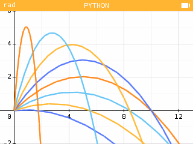

# Numworks-calculator
Python code made to run on a Numworks calculator

Also find these on [https://my.numworks.com/python/vnap0v](https://my.numworks.com/python/vnap0v)

## julia.py


This code displays the Julia set. It uses the kandinsky module. Tested on the calculator using software version 23.2.6.

## mandelbrot_nap0.py


There is a official Numworks Mandelbrot script. This is a different version made from scratch. Uses the library kandinsky. Tested on the calculator using software version 23.2.6.

## sierpinsky.py


Tested on the calculator using software version 23.2.6. Draws a Sierpinsky triangle on the screen. Defines one function sierp(), this function can be used with 1 parameter defining the number of iterations. Uses libraries math and kandinsky.

## logistic2.py


Tested on the calculator using software version 23.2.6. Function logistic_map() draws the bifurcation diagram of the logistic map on the screen. Uses libraries math and kandinsky. Can be used with 2 parameters logistic_map(astart, aend)

## tree.py


Tested on the calculator using software version 23.2.6. This program draws a tree using recursive function calls. It uses the turtle module for the drawing.

## graph_3d.py


This program draws a 3D plot. The function to plot is defined in f_to_plot(x,y). The matplotlib version on the calculator only has 2D capability. This program also has to function within memory which is allocated to Python on the calculator. Tested on the calculator using software version 23.2.6.

## graph3d_kandinsky.py


This program draws a 3D plot. The function to plot is defined in f_to_plot(x,y). This version uses the kandiinsky module. Tested on the calculator using software version 23.2.6.

## sphere.py


This code draws a rotating sphere using the kandinsky module. It also uses the sleep function of the time module and sin(), cos() from the math module. Tested on the calculator using software version 23.2.6.

## heron.py


Tested on the calculator using software version 23.2.6. Defines a function heronarea() which calculates the area of a triangle in terms of the three side lengths. The function can be called with the three lengths as parameters or without parameters. This code can run on CPython as well.

## bal.py



Tested on the calculator using software version 23.2.6. This code tests the matplotlib library of the calculator. It plots ballistic trajectories for a series of different starting angles. It uses libraries math, numpy and matplotlib.pyplot. This code can run on CPython as well.

## rpn.py


This script implements a simple Reverse Polish Notation calculator. 
Numbers are entered on the stack before the operators. 
For example 
```
5*6=
```
would here be entered as 
```
5 [Exe] 6 [Exe] * [Exe]
```
Tested on the calculator using software version 23.2.6

## monte.py


This uses Monte Carlo method to calculate the effect of resistor spread on the output voltage of a 2 resistor voltage divider.
The function montecarlo can be used with or without arguments. Numpy and matplotlib are used, a histogram is displayed at the end. 

Tested on the calculator using software version 23.2.6.

## runge.py


This script uses the 4-order Runge-Kutta method to solve a differential equation.
As example a simple exponential decay function is used.
The solution is plotted together with the directly calculated exponential function.
It uses libraries  numpy and matplotlib.pyplot.
This code can run on CPython as well. Tested on the calculator using software version 23.2.6.

## resistor.py


This script finds the best approximation of an arbitrary resistance value using two series or two parallel resistors out of the standard E12 and E24 series. It imports no modules.Tested on the calculator using software version 23.2.6.

## quirk.py


This script demonstrates a quirk with the numpy implementation in Numworks. 
When tested with software version 23.2.6. 
When multiplying a int or float with a numpy array an error occurs if the int or float comes first. 
For example as in float * array. When the array comes first as in array * float the operation works fine. 
Also converting the int or float to a one element array eliminates the error.

## stopwatch.py


This implements a simple stopwatch. It uses the time module for the monotonic() function. It also uses kandinsky to put text on the screen at a fixed position and ion to detect key presses. Tested on the calculator using software version 23.2.6.
