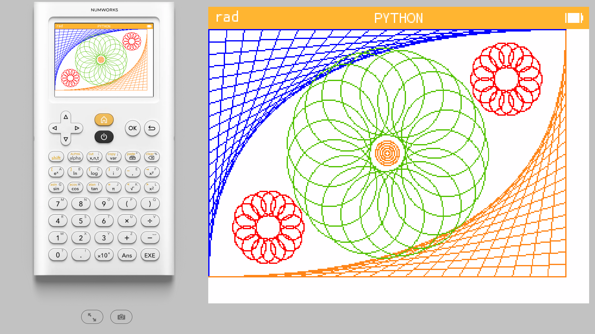
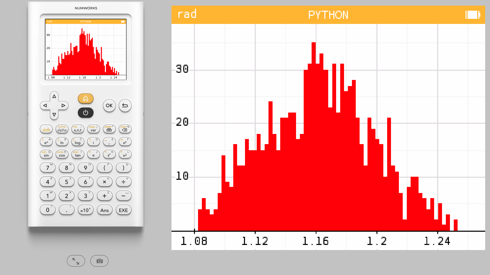
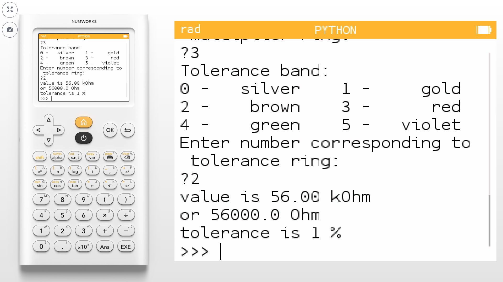
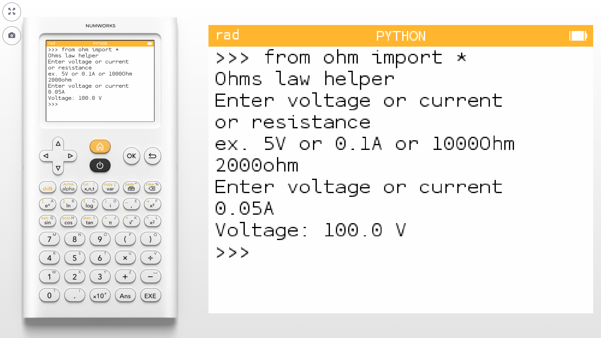

# Numworks-calculator
Python code made to run on a Numworks calculator

Also find these on [https://my.numworks.com/python/vnap0v](https://my.numworks.com/python/vnap0v)

## julia.py


This code displays the Julia set. It uses the kandinsky module. Tested on the calculator using software version 23.2.6.

## mandelbrot_nap0.py


There is a official Numworks Mandelbrot script. This is a different version made from scratch. Uses the library kandinsky. Tested on the calculator using software version 23.2.6.

## sierpinsky.py


 Draws a Sierpinsky triangle on the screen. Defines one function sierp(), this function can be used with 1 parameter defining the number of iterations. Uses libraries math and kandinsky. Tested on the calculator using software version 23.2.6.

## logistic2.py


Tested on the calculator using software version 23.2.6. Function logistic_map() draws the bifurcation diagram of the logistic map on the screen. Uses libraries math and kandinsky. Can be used with 2 parameters logistic_map(astart, aend)

## surf3d.py


This script draws a 3D surface plot. The expression to plot is defined in a python function which takes 2 arguments (x,y) and returns z. Plotting is performed by python function surf() which takes arguments telling it which function to plot and the ranges on x,y and z axis. An optional text string can be added to the plot. It uses only the math and kandinsky libraries. Tested on the calculator using software version 23.2.6.

## line3d.py


This script plots sets of 3 expressions x=f(t),y=g(t),z=h(t)using a simple 3D projection. The expressions to plot are defined in a python function which takes one argument t and returns three values for x,y and z. . Plotting is performed by python function line() which takes arguments telling it which function to plot and the ranges on parameter t, and x, y, z axis. An optional text string can be added to the plot. It uses only the math and kandinsky libraries. Tested on the calculator using software version 23.2.6.

## entend_kandinsky.py



The Kandinsky library has functions to directly draw to the screen but it does not contain a function to draw a line between any two points or a function to draw circles. 

This script defines function connect() which draws a line between two given points and function circle() to draw circles. It uses kandinsky.set_pixel(). 

The script also contains a test of that function drawing several lines of different color. 

Tested on the calculator using software version 23.2.6.

## tree.py


 This program draws a tree using recursive function calls. It uses the turtle module for the drawing. Tested on the calculator using software version 23.2.6.

## sphere.py


This code draws a rotating sphere using the kandinsky module. It also uses the sleep function of the time module and sin(), cos() from the math module. Tested on the calculator using software version 23.2.6. 

## mystify.py


This script displays a simplified “Mystify” screensaver known from past versions of MS Windows. It uses the kandinsky library for drawing, random library for the random corner points and the time library to pace the animation. Tested on the calculator using software version 23.2.6.

## lorenz.py


This script draws a sample solution to the Lorenz System. it uses a simple Euler method to calculate the values. The graph is drawn using kandinsky, it also uses the math library. Tested on the calculator using software version 23.2.6.

## fitdata.py


The Numworks calculator has the Regression app to find polynomials which best fit given data. The calculator’s Python app has a numpy library which contains the function polyfit() for the same purpose. Another function called polyval() evaluates a polynomial for a set of x values. This script demonstrates numpy.polyfit() and numpy.polyval(). Tested on the calculator using software version 23.2.6


## heron.py


Tested on the calculator using software version 23.2.6. Defines a function heronarea() which calculates the area of a triangle in terms of the three side lengths. The function can be called with the three lengths as parameters or without parameters. This code can run on CPython as well.

## bal.py


Tested on the calculator using software version 23.2.6. This code tests the matplotlib library of the calculator. It plots ballistic trajectories for a series of different starting angles. It uses libraries math, numpy and matplotlib.pyplot. This code can run on CPython as well.

## rpn.py


This script implements a simple Reverse Polish Notation calculator. 
Numbers are entered on the stack before the operators. 
For example 
```
5*6=
```
would here be entered as 
```
5 [Exe] 6 [Exe] * [Exe]
```
Tested on the calculator using software version 23.2.6

## monte.py




This uses Monte Carlo method to calculate the effect of resistor spread on the output voltage of a 2 resistor voltage divider.
The function montecarlo can be used with or without arguments. Numpy and matplotlib are used, a histogram is displayed at the end. 

Tested on the calculator using software version 23.2.6.

## runge.py


This script uses the 4-order Runge-Kutta method to solve a differential equation.
As example a simple exponential decay function is used.
The solution is plotted together with the directly calculated exponential function.
It uses libraries  numpy and matplotlib.pyplot.
This code can run on CPython as well. Tested on the calculator using software version 23.2.6.

## resistor.py


This script finds the best approximation of an arbitrary resistance value using two series or two parallel resistors out of the standard E12 and E24 series. It imports no modules.Tested on the calculator using software version 23.2.6.

## colorcode.py



By entering the color-bands of a resistor this scripts gives the value and tolerance. Works with 4 band or 5 band resistors. The script also runs in CPython on a PC. Tested on the calculator using software version 23.2.6.

## quirk.py


This script demonstrates a quirk with the numpy implementation in Numworks. 
When tested with software version 23.2.6. 
When multiplying a int or float with a numpy array an error occurs if the int or float comes first. 
For example as in float * array. When the array comes first as in array * float the operation works fine. 
Also converting the int or float to a one element array eliminates the error.

## stopwatch.py


This implements a simple stopwatch. It uses the time module for the monotonic() function. It also uses kandinsky to put text on the screen at a fixed position and ion to detect key presses. Tested on the calculator using software version 23.2.6.

## ellipse.py


There is no closed-form expression for the circumference of an ellipse. This script approximates the circumference using the sum of a series. Height and width can be given, the ellipse is also plotted. Uses math and matplotlib. Tested on the calculator using software version 23.2.6.

## ohm.py



This ‘Ohms law helper’ allows you to type the two known variables with the unit added for example 5V or 0.1A or 10000ohm and the script automatically calculates the third variable which was unknown. Uses no imported libraries, also runs in CPython on a PC. Tested on the calculator using software version 23.2.6.
